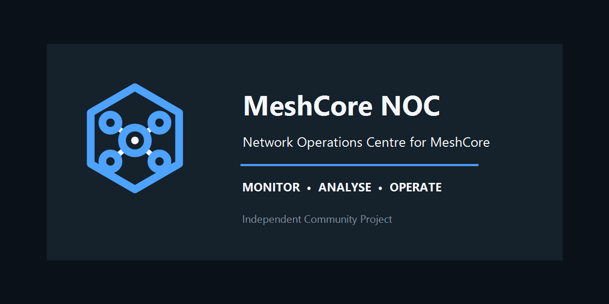

<div align="center">
  <picture>
    <source media="(prefers-color-scheme: dark)" srcset="branding/banner/github_banner_dark.png">
    <source media="(prefers-color-scheme: light)" srcset="branding/banner/github_banner_light.png">
    
  </picture>

  # MeshCore NOC

  **Network Operations Centre for MeshCore**

  **Monitor • Analyse • Operate**

  _Independent Community Project_

  [](CHANGELOG.md)
  [](ROADMAP.md)
  [](https://www.home-assistant.io/)
  [](https://github.com/Jacolrsa/MeshCore-NOC/tree/main)
</div>

## Project introduction

MeshCore NOC turns MeshCore telemetry and device identity into a focused Home
Assistant operations experience. It discovers upstream MeshCore devices, lets
an operator choose the managed fleet, creates stable per-repeater entities, and
provides a compact Mission Control dashboard for daily monitoring and clock
checks.

The project is designed for network operators who want useful fleet status
without manually assembling helper entities or relying on Developer Tools for
normal operation. MeshCore remains responsible for transport and raw telemetry;
MeshCore NOC consumes supported Home Assistant services, events, states, and
registries.

> MeshCore NOC `1.0.0` is the first clean public release. Back up Home
> Assistant before installation. The project is not currently distributed
> through HACS.

### Upgrade note

Development installations using a pre-release 4.x version must be removed and
installed fresh because the public release version sequence restarts at 1.0.0.

## Feature highlights

| Monitor | Analyse | Operate |
| --- | --- | --- |
| Calibrated voltage and battery | Health and freshness classification | Dashboard-first fleet clock checks |
| Repeater availability and telemetry age | Clock offset and retained status | Per-repeater Check Clock controls |
| Fleet KPIs and Recorder graphs | Network and fleet clock summaries | Serialized checks with cancellation |

- Discovers MeshCore-owned devices without manual entity IDs.
- Preserves stable MeshCore identity across setup, reload, and selection changes.
- Provides a responsive, one-screen Mission Control dashboard.
- Exposes calibrated voltage, battery, health, freshness, clock offset, and
  clock status.
- Runs safe single-repeater and serialized fleet clock checks through existing
  Home Assistant contracts.
- Includes redacted diagnostics and native Stable/Development update channels.

## Dashboard previews

Live, redacted screenshots will replace these reserved placements after the
v1.0.0 dashboard completes hardware validation.

| Mission Control — desktop | Repeater Clock Intelligence |
| --- | --- |
| _Screenshot placeholder: 1920×1080 fleet overview with eight repeaters_ | _Screenshot placeholder: expanded repeater clock details and Check Clock control_ |

| Fleet clock run | Responsive operations view |
| --- | --- |
| _Screenshot placeholder: active serialized run with progress and cancellation_ | _Screenshot placeholder: compact tablet/mobile layout_ |

See the [screenshot capture checklist](docs/images/README.md).

## Capabilities

- Discovers MeshCore-owned devices without manual entity IDs.
- Preserves stable MeshCore identities in config-entry options.
- Creates one managed MeshCore NOC device for each selected, resolved source.
- Creates four device-scoped entities:
  - calibrated voltage;
  - calibrated battery percentage;
  - health; and
  - freshness.
- Preserves the established ProMicro device and entity identities from Alpha2.
- Refreshes from source-state listeners and a one-minute freshness timer.
- Reconciles selection changes without deleting upstream MeshCore records.
- Automatically registers a local Lovelace strategy and the **MeshCore NOC**
  sidebar dashboard.
- Provides Mission Control header, eight KPIs, managed-device cards, native
  Recorder graphs, battery comparison, and presentation-level alerts.
- Provides a controller-scoped Home Assistant Update entity with Stable and
  Development channels.
- Validates, backs up, replaces, and rolls back integration updates.
- Exposes diagnostics for discovery, lifecycle, dashboard, and updater state.

Alpha5.2 uses a fixed `-0.816 V` calibration offset and maps calibrated
`3.000–4.200 V` linearly to `0–100%`. Configurable calibration, predictive
battery intelligence, charging detection, solar analysis, topology, maps,
detail popups, and persistent alert entities are not implemented.

## Architecture

```text
MeshCore integration
  └─ raw devices, stable identities, source entities, telemetry
       ↓ Home Assistant registries and state machine
MeshCore NOC discovery and selection
  └─ one coordinator per selected managed device
       ├─ Calibrated Voltage
       ├─ Calibrated Battery
       ├─ Health
       └─ Freshness
            ↓
       Mission Control dashboard

MeshCore NOC controller
  └─ Update entity
       ├─ Stable: published GitHub Releases
       └─ Development: v4-development manifest
```

MeshCore remains responsible for source discovery, identity, and raw telemetry.
MeshCore NOC owns only selected managed devices and its derived operational
experience. Read [MH-103 — Architecture](docs/MH-103_Architecture.md) for the
data flow, lifecycle, trust boundary, diagnostics, and testing strategy.

## Requirements

- A Home Assistant installation with the upstream MeshCore integration already
  configured.
- MeshCore source devices represented in Home Assistant’s device and entity
  registries.
- Manual access to `/config/custom_components`.
- Home Assistant Recorder for history graphs; current values work without it.
- Home Assistant 2026.3 or newer for local custom-integration branding.

The repository’s existing development notes document Home Assistant 2026.6 or
newer as the tested development baseline. Live compatibility should be
validated before broad deployment.

## Installation

### Manual copy

1. Back up Home Assistant.
2. Download the `v4.0.0` release or check out the `main` branch.
3. Copy the entire repository folder:

   ```text
   custom_components/meshcore_noc
   ```

   to:

   ```text
   /config/custom_components/meshcore_noc
   ```

4. Confirm this file exists:

   ```text
   /config/custom_components/meshcore_noc/manifest.json
   ```

5. Restart Home Assistant Core fully.
6. Open **Settings → Devices & services → Add integration**.
7. Search for **MeshCore NOC**.
8. Select the discovered MeshCore devices to manage and choose an update
   channel.

For an SSH checkout:

```sh
cd /config
INSTALL_TMP="$(mktemp -d)"
git clone --depth 1 --branch main \
  https://github.com/Jacolrsa/MeshCore-NOC.git \
  "$INSTALL_TMP/MeshCore-NOC"
mkdir -p /config/custom_components/meshcore_noc
cp -a "$INSTALL_TMP/MeshCore-NOC/custom_components/meshcore_noc/." \
  /config/custom_components/meshcore_noc/
```

Do not remove and re-add an existing MeshCore NOC config entry during a normal
upgrade. Replace the component files, restart Home Assistant, and reload the
entry only if state remains stale after restart. See the
[installation guide](docs/installation.md).

## Configuration

Open **Settings → Devices & services → MeshCore NOC → Configure** to:

- replace the set of managed MeshCore devices; and
- select **Stable** or **Development** updates.

Submitting options reloads the config entry. Retained stable IDs keep their
registry identities and history. Deselected NOC-owned entities and empty
managed devices are removed after platform unload; upstream MeshCore devices,
Template entities, and helpers are not removed.

The first selected device on a new installation receives the legacy ProMicro
compatibility identity. On an upgraded installation, registry ownership keeps
that identity attached to the same stable device. Its entity IDs remain:

```text
sensor.meshcore_noc_promicro_repeater_calibrated_voltage
sensor.meshcore_noc_promicro_repeater_calibrated_battery_percentage
sensor.meshcore_noc_promicro_repeater_health
binary_sensor.meshcore_noc_promicro_repeater_fresh
```

Additional managed devices use stable-ID-based unique IDs and friendly,
normalised entity-ID slugs.

## Fleet clock checks

Clock Intelligence can check one managed repeater with
`meshcore_noc.check_clock` or start a serialized fleet run with
`meshcore_noc.check_all_clocks`. Fleet runs snapshot the currently managed,
addressable repeaters and dispatch exactly one `clock` command at a time. The
next repeater is not checked until the current one completes, fails, or times
out and the configured safety delay expires.

Fleet controls are available as `button.check_all_clocks` and
`button.cancel_clock_check`. Cancellation never retracts a transmitted command;
it waits for the current check to finish and stops before the next dispatch.
Progress, lifecycle state, last completion, and running state are exposed as
fleet-level diagnostic entities on the MeshCore NOC device.

Automatic fleet checks are disabled by default. Configuration options control
the interval, success delay, failure/timeout delay, and optional rotating start
point. The first scheduled run occurs only after the full configured interval.
Fleet history is limited to the latest 20 in-memory runs and is reset by a
restart.

Fleet Clock Management also provides central **Synchronise All Clocks**
control. It processes the current managed, addressable repeater set
sequentially with a two-second network-pacing delay, continues after individual
failures, and reports a structured result for every repeater.

Automatic fleet synchronisation is configured in the integration options. It
is disabled by default and supports 6, 12, 24, 72, or 168 hour intervals. An
overdue schedule runs once after Home Assistant starts; missed intervals are
not replayed.

> Repeaters are synchronised to the connected MeshCore companion clock. Ensure
> the companion clock is correct before enabling automatic synchronisation.

Every addressable managed repeater also has a **Check Clock** button on its
Home Assistant device. The Mission Control dashboard uses those button entities
and the fleet buttons; it does not issue MeshCore commands itself.

Clock Offset and Clock Status retain the last successful reading when a later
attempt times out, fails, or contains a malformed reply. Their attributes expose
the latest attempt time, outcome, error, successful-reading time, data age, RTT,
response text, sender timestamp, and bounded attempt history. Unknown means no
successful clock response has been recorded since the integration was loaded.
Retained clock readings are currently in memory and are not restored after a
Home Assistant restart.

## Mission Control dashboard

MeshCore NOC automatically registers its bundled JavaScript as a local
Lovelace module and creates the **MeshCore NOC** sidebar dashboard at
`/meshcore-noc`. No dashboard YAML, `/config/www` copy, manual resource, or
HACS frontend card is required.

The primary Mission Control view contains:

- one compact status header combining network health, alerts, fleet clock
  state, automatic-sync state, and fleet actions;
- a concise, clickable fleet repeater list;
- one large calibrated-voltage history chart with 24-hour, 7-day, and 30-day
  ranges; and
- one generated detail subview for every managed repeater.

The dashboard is the normal Clock Intelligence control surface. **Check All
Clocks** and **Sync All Clocks** operate the existing controller entities.
Active runs show progress and the current repeater without creating a separate
large Clock Management card. Each repeater detail view retains the existing
single-repeater check action and invokes the existing authenticated
`meshcore_noc.sync_repeater_clock` service.

Detail views consolidate monitoring, clock status/results, source identity,
advanced diagnostics, and explicit per-repeater management. Administrators can
save calibrated-voltage settings, battery/Last Seen/clock thresholds, a
dashboard display name, and a private repeater password. Settings are keyed by
the existing NOC stable ID and persist through Home Assistant restarts and
integration reloads. A stored password is never returned by the backend,
exposed by entities or diagnostics, or written to integration logs.

Recorder is required only for historical graphs. If another dashboard already
uses the `meshcore-noc` path, the integration preserves it and posts a
persistent notification instead of overwriting it.

After installing a new frontend bundle, restart Home Assistant and hard-refresh
the browser.

## Health and freshness

| Freshness | Condition |
| --- | --- |
| Fresh | Under 75 minutes |
| Aging | 75–119 minutes |
| Stale | 120–179 minutes |
| Offline | 180 minutes or more, or source unavailable |

Health is:

- **Unknown** without a battery value;
- **Poor** when Offline or battery is below 20%;
- **Fair** when Stale or battery is below 40%;
- **Good** when Aging or battery is below 80%; and
- **Excellent** otherwise.

## Update channels

The native Update entity belongs to the MeshCore NOC controller device.

### Stable

Stable is the default. It checks published GitHub Releases and ignores drafts
and prereleases. Until a valid stable release exists, the latest version is
Unknown.

### Development

Development checks the manifest on `v4-development` and includes latest commit
metadata when GitHub provides it. It may contain unfinished or unstable work.
Detection is version-based: a commit with an unchanged manifest version is not
offered as a new build.

Both channels check at startup and at most every six hours. A temporary network
failure retains the last successful result; unexpected remote metadata enters a
safe Unknown state and records a bounded diagnostics error.

Installation validates archive paths, symlinks, sizes, required files, domain,
and exact version. It backs up only the installed integration under
`/config/meshcore_noc_backups`, keeps the five newest backups, replaces the
component, and requests a Home Assistant restart. The loaded version changes
only after restart.

Read the [update-channel guide](docs/updates.md) and
[MH-104 — Release Process](docs/MH-104_Release_Process.md).

## Diagnostics and support

Download diagnostics from **Settings → Devices & services → MeshCore NOC →
three-dot menu → Download diagnostics**. Before reporting an issue:

1. confirm upstream MeshCore entities are available;
2. restart Home Assistant after a component upgrade;
3. inspect **Settings → System → Logs**;
4. review [troubleshooting](docs/troubleshooting.md); and
5. attach redacted diagnostics to the
   [bug report](.github/ISSUE_TEMPLATE/bug_report.yml).

Do not publish credentials, private node IDs, locations, or unreviewed
diagnostics.

## Documentation

| Document | Purpose |
| --- | --- |
| [MH-100 — UI Specification](docs/MH-100_UI_Specification.md) | Mission Control requirements and acceptance criteria |
| [MH-101 — Design System](docs/MH-101_Design_System.md) | Visual semantics, components, accessibility, and motion |
| [MH-102 — Product Roadmap](docs/MH-102_Roadmap.md) | Implemented foundation and planned phases |
| [MH-103 — Architecture](docs/MH-103_Architecture.md) | Current components, data flow, lifecycle, updater, diagnostics |
| [MH-104 — Release Process](docs/MH-104_Release_Process.md) | Alpha/stable release, validation, acceptance, rollback |
| [Installation](docs/installation.md) | Manual deployment and live verification |
| [Update channels](docs/updates.md) | Channel behaviour and installation safeguards |
| [Troubleshooting](docs/troubleshooting.md) | Common installation and telemetry issues |
| [Migration](docs/MIGRATION.md) | v3-to-v4 migration guardrails |
| [Brand guide](branding/docs/BRAND_GUIDE.md) | Logo, colour, typography, spacing, and usage rules |
| [Security](SECURITY.md) | Supported reporting process |

## Roadmap

Foundation shipped in v4.0.0 and Professional UI work remains ongoing.
Predictive intelligence, network operations views, and version 1.0 readiness
remain planned. See the [concise roadmap](ROADMAP.md) and
[detailed product roadmap](docs/MH-102_Roadmap.md).

## Development and contributing

Useful repository checks:

```sh
python scripts/validate_branding.py
python -m compileall -q custom_components/meshcore_noc
ruff check custom_components tests scripts
ruff format --check custom_components tests scripts
pytest -q
node --test tests/frontend/test_dashboard.js
git diff --check
```

Read [CONTRIBUTING.md](CONTRIBUTING.md) before proposing a change. Participation
is governed by the [Code of Conduct](CODE_OF_CONDUCT.md).

## Community

MeshCore NOC is built in the open for operators, radio enthusiasts, and Home
Assistant users:

- report reproducible defects with the
  [bug report template](.github/ISSUE_TEMPLATE/bug_report.yml);
- propose scoped improvements with the
  [feature request template](.github/ISSUE_TEMPLATE/feature_request.yml);
- review the [roadmap](ROADMAP.md) before proposing major functionality;
- follow [CONTRIBUTING.md](CONTRIBUTING.md) and the
  [Code of Conduct](CODE_OF_CONDUCT.md); and
- never publish credentials, private node identifiers, precise locations, or
  unreviewed diagnostics.

## Disclaimer

> MeshCore NOC is an independent community-developed project for use with MeshCore
> networks. It is not affiliated with, endorsed by, sponsored by, or maintained by
> the MeshCore project or its developers. MeshCore is referenced solely to describe
> compatibility.

## Licence and acknowledgements

MeshCore NOC is licensed under the MIT License. See the root
[`LICENSE`](LICENSE) file for the full terms. Referenced upstream projects
remain subject to their own licences.
