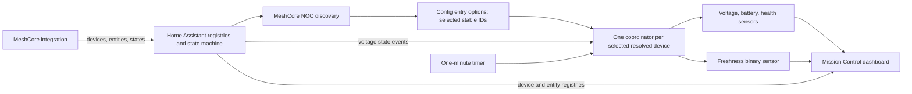
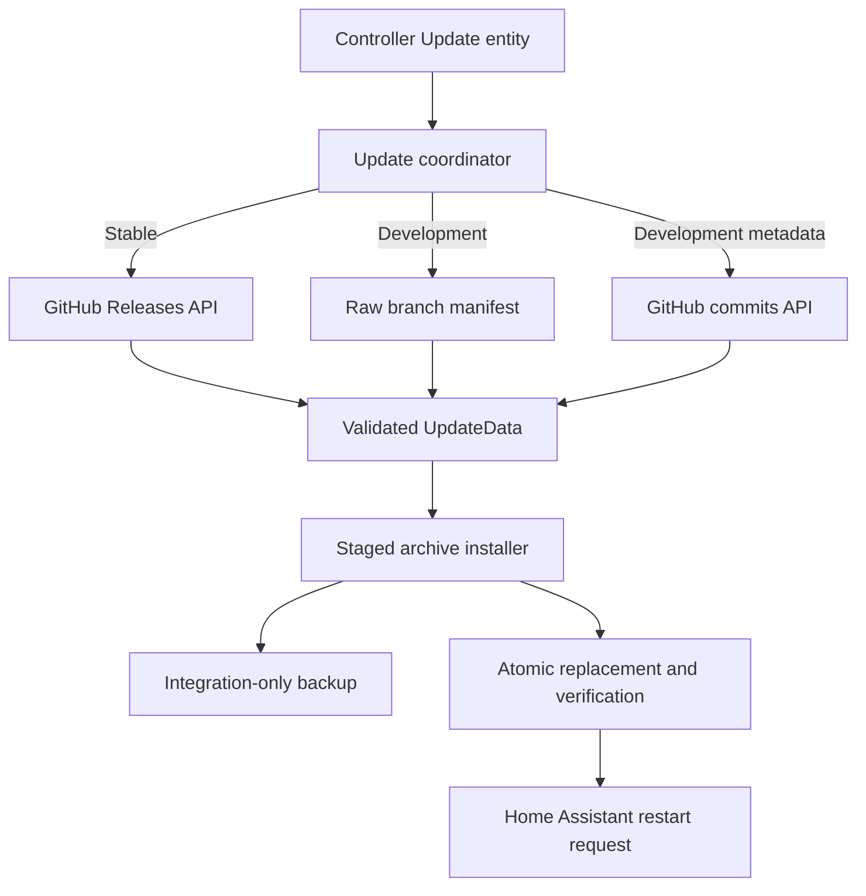

# MH-103 — MeshCore NOC Architecture

| Field | Value |
| --- | --- |
| Status | Current architecture |
| Revision | 1.0 |
| Baseline | `4.0.0` on `main` |

## Ownership boundary

### Upstream MeshCore integration

MeshCore is the source of truth for:

- source device discovery;
- raw MeshCore device identities;
- source entity ownership;
- raw telemetry and availability; and
- the config entries that connect Home Assistant to MeshCore.

MeshCore NOC reads Home Assistant’s device registry, entity registry, and state
machine. It does not edit upstream MeshCore devices or entities.

### MeshCore NOC integration

MeshCore NOC owns:

- the single NOC config entry and its selected stable IDs;
- managed-device lifecycle;
- fixed voltage calibration;
- calibrated battery percentage;
- health and freshness classifications;
- dashboard-level alert presentation;
- the generated Lovelace strategy dashboard;
- Stable and Development update channels;
- update installation, integration-only backups, and rollback; and
- redacted diagnostics.

Alpha5.2 does not implement configurable calibration, predictive battery
intelligence, charging or solar analysis, topology, maps, or persistent alert
entities.

## Component overview

| Component | Responsibility |
| --- | --- |
| `config_flow.py` | Single-instance setup, source selection, update-channel options |
| `discovery.py` | Registry-owned MeshCore device discovery, type classification, source-role ranking |
| `models.py` | Immutable discovery and managed telemetry records |
| `__init__.py` | Entry setup, coordinator creation, platform forwarding, selection reconciliation, unload cleanup |
| `coordinator.py` | Per-managed-device calculation snapshot, source listener, freshness timer |
| `entity.py` | Stable entity and managed-device identity |
| `sensor.py` | Calibrated voltage, calibrated battery, and health |
| `binary_sensor.py` | Freshness binary sensor and detailed freshness attributes |
| `dashboard.py` | Local frontend serving, Lovelace resource registration, strategy dashboard creation |
| `frontend/meshcore-noc-dashboard.js` | Registry-driven Mission Control UI, KPIs, cards, graphs, presentation alerts |
| `update.py` | Controller-scoped Home Assistant Update entity |
| `updater.py` | Channel polling, GitHub trust boundary, version comparison, archive validation and installation |
| `diagnostics.py` | Discovery, lifecycle, dashboard, and updater diagnostics |

## Data flow



In plain terms: discovery associates stable MeshCore devices with source
entities; the user selects stable IDs; setup creates one coordinator per
selected source; each coordinator calculates one immutable snapshot consumed by
four entities; and the dashboard discovers only NOC-owned managed devices and
their NOC entities.

## Config entry and options flow

The integration is single-instance. Setup aborts if MeshCore is not configured.
The config flow discovers MeshCore-owned registry devices and stores:

```json
{
  "data": {
    "meshcore_config_entry_ids": ["<source config entry ID>"]
  },
  "options": {
    "managed_repeater_ids": ["<stable MeshCore ID>"],
    "update_channel": "stable"
  }
}
```

The historical `managed_repeater_ids` key is retained for compatibility even
though discovery can classify selected devices as repeaters, clients, or
unknown. Changing selection or channel in the options flow reloads the entry.

Before reload, the update listener records created, retained, and removed
stable IDs. After platform unload, cleanup removes only NOC-platform entity
records attached to deselected NOC devices and removes an empty NOC managed
device. Upstream MeshCore records and unrelated helpers are not targeted.

## Discovery

Discovery begins with loaded `meshcore` config entries. A source device must
have MeshCore ownership and a MeshCore identifier; no friendly name is used as
identity. Device type is classified from structured device metadata first,
then entity metadata, with display name as a low-confidence fallback.

Source-role candidates are ranked using registry metadata such as translation
key, unique ID, device class, unit, original name, and entity ID. Missing
optional roles do not remove the device from discovery. Alpha5.2 calculations
use the mapped voltage entity; other mappings remain diagnostic and future
integration points.

## Managed-device creation and stable identifiers

For every selected stable ID present in the discovery snapshot, setup creates:

- one `MeshCoreNocCoordinator`;
- one managed device identified by `(meshcore_noc, stable_id)`;
- calibrated voltage;
- calibrated battery percentage;
- health; and
- freshness.

The managed device is linked through the MeshCore NOC controller device. New
unique IDs use:

```text
managed_repeater_<stable_id>_<entity suffix>
```

The original Alpha2/ProMicro device retains its established
`promicro_repeater_<suffix>` unique IDs. The integration locates the registry
device that already owns the legacy voltage entity; selection reordering cannot
transfer that identity. On a new installation, the first selected stable ID
receives the compatibility identity.

Friendly names and proposed entity IDs are presentation data. Stable IDs and
unique IDs are authoritative.

## Coordinator and entity flow

Each managed device has one coordinator shared by its four entities. The
coordinator:

1. subscribes once to the mapped voltage source entity;
2. requests a debounced refresh on source state changes;
3. refreshes every minute so freshness advances without new telemetry;
4. parses and validates the raw voltage;
5. applies the fixed `-0.816 V` offset;
6. maps calibrated `3.000–4.200 V` linearly to `0–100%`;
7. derives freshness from source availability and age; and
8. derives health from battery and freshness.

Freshness bands are:

| State | Age / condition |
| --- | --- |
| Fresh | under 4,500 seconds |
| Aging | 4,500–7,199 seconds |
| Stale | 7,200–10,799 seconds |
| Offline | 10,800 seconds or more, unavailable, invalid, or no timestamp |

Health is Unknown without battery data; Poor when offline or below 20%; Fair
when stale or below 40%; Good when aging or below 80%; otherwise Excellent.

## Dashboard strategy

At setup, `dashboard.py` serves the bundled JavaScript from the integration
namespace and registers its versioned URL as a Lovelace module resource. It
creates the `meshcore-noc` strategy dashboard through Home Assistant’s
dashboard collection API when that path is available.

The backend never directly edits `.storage`. A conflicting user dashboard is
preserved and a persistent notification explains the manual fallback.

The frontend reads device and entity registries, selects devices with
MeshCore NOC stable identifiers other than the controller, and maps NOC entity
unique-ID suffixes to voltage, battery, health, and freshness roles. The
primary panel contains Mission Control, eight KPIs, an adaptive device grid,
both primary 24-hour Recorder graphs, and presentation alerts. A secondary
Trends view preserves the seven-day battery graph and current battery
comparison. Registry changes regenerate the strategy; state changes update the
card.

## Update architecture



Stable is the default. It reads published GitHub Releases, ignoring drafts and
prereleases. Development reads the `v4-development` manifest and optionally its
changelog and latest commit metadata. Both use one six-hour update coordinator
and Home Assistant’s shared asynchronous HTTP session.

The Update entity reports the currently loaded `INTEGRATION_VERSION`; replacing
files does not change that value until Home Assistant restarts.

## GitHub validation and trust boundary

Source URLs must use HTTPS and match the MeshCore NOC repository on official
GitHub hosts. Response URLs are restricted to official GitHub API, raw content,
repository, and archive hosts. Remote metadata is type-checked and versions are
parsed rather than compared lexically.

Unexpected metadata produces an Unknown update result and a debug-level reason.
Network and HTTP failures retain the last successful result. Unrelated
exceptions are not broadly suppressed.

Before installation, the updater limits compressed and expanded size, entry
count, paths, encryption, and symlinks. It extracts only
`custom_components/meshcore_noc`, verifies required files, domain, and exact
offered version, then creates a timestamped integration-only backup. Failed
replacement verification restores the previous component.

## Diagnostics

Config-entry diagnostics include:

- integration version and source config entries;
- discovered and selected devices;
- classification confidence and source mappings;
- missing roles and discovery warnings;
- active/unresolved stable IDs;
- reconciliation and duplicate-identity checks;
- per-managed-device calculations and listener state;
- dashboard registration state; and
- update channel, versions, check state, branch metadata, errors, and
  installation state.

Diagnostics intentionally exclude telemetry history and credentials. Stable IDs
and entity IDs may still be operationally sensitive and should be reviewed
before public sharing.

## Unload behaviour

Platforms unload first. On successful unload:

- every per-device source listener is removed;
- deselected NOC entity registry records are removed;
- empty deselected NOC managed devices are removed; and
- upstream MeshCore and unrelated registry records remain untouched.

The dashboard and global Lovelace resource intentionally remain so reloads do
not create duplicates. If the integration is removed, the retained dashboard
shows a safe empty or unavailable state and can be deleted manually.

## Failure isolation

- A selected stable ID missing from discovery is unresolved, not assigned an
  invented identity.
- Missing or invalid voltage produces unavailable derived values and Offline
  freshness.
- One coordinator provides an internally consistent snapshot for all four
  device entities.
- Update checking is separate from managed telemetry coordination.
- Optional Development changelog or commit metadata failure does not invalidate
  a valid manifest result.
- Dashboard path collisions do not overwrite user content.
- Registry cleanup is limited to known NOC ownership.
- Archive replacement has validation, backup, and rollback boundaries.

## Testing strategy

The repository tests:

- config and options flows;
- discovery identity, classification, and role ranking;
- coordinator calculations, freshness, listeners, and unload;
- entity/device registration and stable-ID compatibility;
- managed selection reconciliation and cleanup;
- dashboard registration and frontend generation;
- updater channels, malformed metadata, URL trust, version comparison,
  archive security, backup, rollback, and restart; and
- diagnostics.

Python uses `pytest`, Ruff, compilation checks, and `git diff --check`.
Frontend behaviour has Node-based tests under `tests/frontend`. Branding has a
dedicated validation script. Live Home Assistant validation remains necessary
for registry contracts, browser presentation, Recorder graphs, and update
installation.
