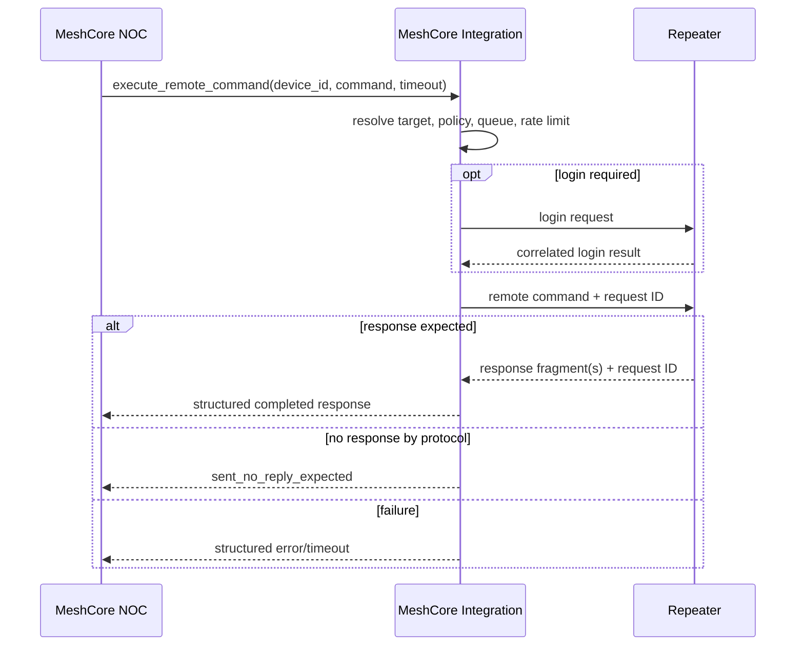
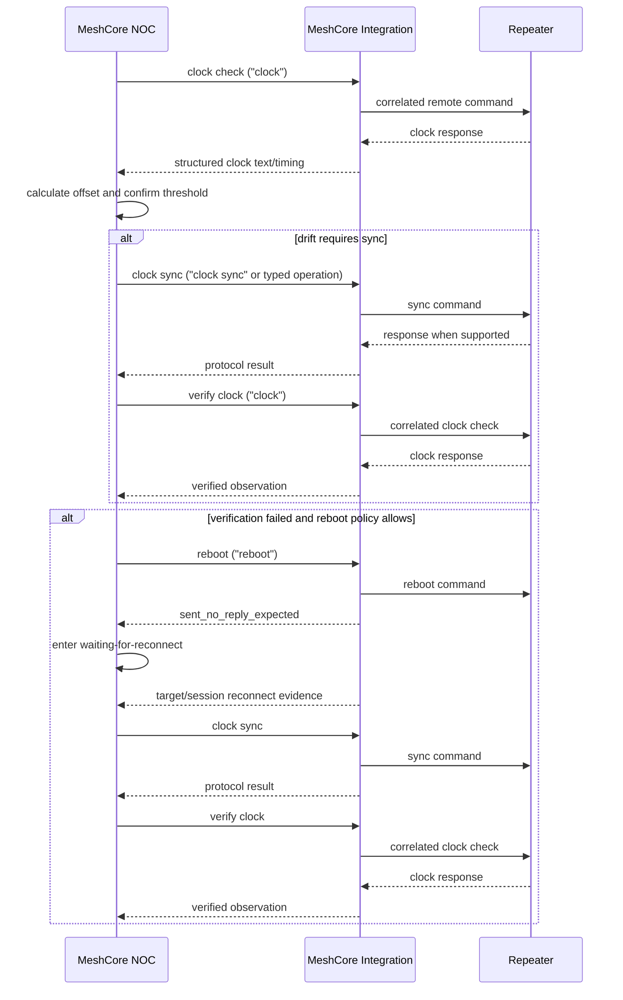

# MeshCore NOC v1.0 Command Framework Investigation

## Project constraint and current decision

MeshCore NOC will not require modifications to the MeshCore Home Assistant
integration. NOC will not fork, patch, monkey-patch, or import private modules
from it, and will not access serial, BLE, TCP, or meshcore-py directly. The only
permitted boundary is Home Assistant's public service, event, entity, and
registry APIs.

This constraint supersedes the upstream-extension recommendations retained
later in this investigation as historical design analysis. The current strategy
is to validate the installed `meshcore.execute_command` contract through the
public live-test procedure in
[V4_1_EXISTING_SERVICE_LIVE_TEST.md](V4_1_EXISTING_SERVICE_LIVE_TEST.md).
No runtime adapter is implemented until that live evidence confirms safe
targeting and authentication.

Status: Phase 2 investigation and proof-of-concept design

This document records a source audit and proposes an interface. It does not
implement command transport, entities, services, recovery, or dashboard
behavior in MeshCore NOC.

## Evidence and scope

No running Home Assistant instance, container, configuration directory, or
installed `custom_components/meshcore` tree was available on the development
machine. The available Home Assistant virtual environment also did not contain
the MeshCore integration. The exact integration and SDK versions installed in
production therefore remain unverified.

To continue the investigation without inventing an API, the authoritative
upstream repositories were audited at these revisions:

- `meshcore-dev/meshcore-ha`, commit
  `1ee608a3f065d653ae0a69b6bc9b716ed5ef4610`, manifest version `2.9.0`;
- `meshcore-dev/meshcore_py`, commit
  `c487efbe187f4b000020afdfc0349c4cdf503c5a`.

The MeshCore HA manifest requires `meshcore>=2.3.7`. Findings in this document
are confirmed for the audited source revisions, not automatically for an
unknown installed version. A live version and hardware proof remains required.

## Audit inventory

### MeshCore Home Assistant integration

The following upstream files participate in communication or expose it:

| File | Responsibility |
| --- | --- |
| `manifest.json` | Declares local polling and the meshcore-py dependency |
| `__init__.py` | Creates the API/coordinator, connects, registers services/platforms, forwards SDK events, handles unload |
| `config_flow.py` | Selects USB, BLE, or TCP and configures tracked remote nodes |
| `meshcore_api.py` | Creates serial/BLE/TCP SDK clients, validates with appstart, syncs local-radio time, handles disconnect/reconnect |
| `coordinator.py` | Five-second base scheduling, remote status/telemetry polling, message flushing, backoff, token bucket use |
| `services.py` | Message services, generic SDK command parser/dispatcher, CLI response event, structured query services |
| `services.yaml` | Home Assistant service metadata and selectors |
| `rate_limiter.py` | Shared token bucket used by scheduled mesh requests |
| `sensor.py` | Event-driven local, remote, telemetry, and CLI-console sensors |
| `binary_sensor.py` | Contact/message/update event subscriptions and online state |
| `telemetry_sensor.py` | Dynamic telemetry entities subscribed to SDK events |
| `device_tracker.py` | Dynamic GPS entities subscribed to telemetry events |
| `button.py`, `text.py` | CLI Console helpers that call `execute_command_ui` |
| `mqtt_uploader.py` | Optional outbound MQTT publication; MQTT TCP/WebSocket is not the radio transport |
| `map_uploader.py` | Optional event consumer/uploader |
| `utils.py`, `logbook.py` | Event sanitization, parsing, and presentation |

No integration-specific Home Assistant WebSocket command is registered.
Home Assistant clients may invoke services through Home Assistant's generic
WebSocket API, but that is not a MeshCore radio transport.

### meshcore-py

The following SDK files implement the lower-level path:

| File | Responsibility |
| --- | --- |
| `meshcore.py` | Factory construction, reader, commands, dispatcher, and connection manager |
| `serial_cx.py` | USB serial framing/read/write |
| `ble_cx.py` | BLE GATT connection, notifications, serialized bounded writes |
| `tcp_cx.py` | TCP stream connection/read/write |
| `connection_manager.py` | Connection lifecycle, disconnect events, bounded auto-reconnect |
| `reader.py` | Parses frames, updates caches, and emits typed events |
| `events.py` | Event types, async queue, subscriptions, filters, and waits |
| `commands/base.py` | Subscribe-before-send response wait, timeout, cleanup, request lock |
| `commands/device.py` | Local companion commands including clock and reboot |
| `commands/messaging.py` | Login, remote text command, and message operations |
| `commands/binary.py` | Correlated synchronous remote requests |
| `commands/contact.py`, `control_data.py` | Contact and structured control requests |

## Existing MeshCore communication architecture

### Transport

Home Assistant connects to one local MeshCore companion radio per config entry
using exactly one of:

- USB serial via `MeshCore.create_serial`;
- Bluetooth Low Energy via `MeshCore.create_ble`; or
- TCP via `MeshCore.create_tcp`, default port 5000.

All three use meshcore-py's binary command/event protocol. MQTT is an optional
outbound event/status uploader and may itself use TCP or WebSockets to reach a
broker; it is not used to command a MeshCore radio. No serial terminal
subprocess, shell CLI, Home Assistant REST endpoint, or integration-specific
WebSocket transport is involved.

### Connection and reconnect

`MeshCoreAPI.connect` constructs the SDK client with auto-reconnect enabled and
up to 100 attempts. It waits briefly, sends `send_appstart`, rejects an error or
missing response, registers an SDK `DISCONNECTED` handler, and sets the local
companion radio's time with `set_time(int(time.time()))`.

The SDK connection manager emits typed `CONNECTED`, `DISCONNECTED`,
`RECONNECTING`, `RECONNECTED`, and `RECONNECT_FAILED` events. The HA wrapper
also fires `meshcore_connected` and `meshcore_disconnected`. If SDK
auto-reconnect gives up, the HA wrapper starts a one-minute periodic reconnect
loop and syncs the local radio's time after reconnection.

The audited HA wrapper does not expose a session ID or target-specific
reconnect proof for a remote repeater.

### Polling and push

The integration is hybrid:

- its manifest declares `local_polling`;
- the coordinator uses a configurable base tick, default five seconds;
- the tick reconnects when required, polls local battery, flushes queued
  messages, and schedules due remote status/telemetry/neighbor work;
- remote repeater status defaults to a two-hour interval;
- scheduled mesh requests use a shared token bucket of 20 requests with one
  token refilled every 120 seconds;
- the SDK reader continuously parses incoming frames and dispatches typed
  events; and
- `MESSAGES_WAITING` triggers an immediate, lock-protected message flush.

Thus polling initiates many observations, while entity state changes are
predominantly pushed from parsed SDK events.

### Entity update and callback flow

```text
USB / BLE / TCP bytes
  -> meshcore-py transport reader
  -> MessageReader parser/cache update
  -> EventDispatcher async queue
  -> typed SDK EventType callback
  -> entity callback or HA integration handler
  -> entity async_write_ha_state / coordinator async_set_updated_data
  -> Home Assistant state machine
  -> MeshCore NOC state listener and derived calculations
```

The integration also subscribes to all SDK events, sanitizes payloads, and
fires `meshcore_raw_event` on the Home Assistant event bus. Consumers should
prefer supported typed services/events over parsing this broad diagnostic
stream.

## Existing command capabilities

### Local companion radio

`meshcore.execute_command` is a generic Home Assistant service. It accepts:

- `command`: SDK method name plus arguments;
- optional `entry_id`: selects the local companion/config entry; and
- optional `record_to_console`.

It supports positional and restricted literal functional syntax, resolves
contact arguments, dynamically selects a method from
`api.mesh_core.commands`, executes it, and normalizes event/dict/scalar results
into a JSON-safe service response. It is registered with
`SupportsResponse.OPTIONAL`.

When console recording is enabled it stores a bounded command/response
transcript and fires `meshcore_cli_response` containing the command, normalized
response, error flag, entry ID, and timestamp.

Confirmed local companion methods include:

- `get_time`, returning `CURRENT_TIME`;
- `set_time <epoch>`, returning `OK` or `ERROR`;
- `reboot`, which is fire-and-forget at SDK level;
- local battery, device information, statistics, configuration, contacts, and
  channels; and
- remote messaging and structured request helpers.

These local clock/reboot methods act on the directly connected companion radio,
not a managed remote repeater.

### Remote repeaters

The confirmed remote path is:

1. resolve a contact by public-key prefix or name;
2. authenticate with `send_login_sync(contact, password)`;
3. invoke `send_cmd(contact, "<repeater CLI text>")`.

Official repeater CLI commands include:

- `clock` to display UTC time;
- `clock sync` to sync with the remote device;
- `time <epoch_seconds>` to set a time;
- `reboot` with no reply; and
- `clkreboot` to reset clock and reboot, with no reply.

The remote target on the wire is a public-key prefix derived from a contact.
The HA integration's repeater device identifier combines config-entry ID,
device type, and configured public-key prefix. NOC must not assume its current
opaque `("meshcore", stable_id)` string is directly routable; target resolution
must remain upstream-owned.

### Existing response handling

Local SDK commands use a subscribe-before-send pattern. A command registers
subscriptions for expected event types, sends bytes, waits for the first
matching event, cancels unused futures, unsubscribes in `finally`, and returns a
typed error on timeout/no event.

Some structured remote operations already have synchronous helpers. Examples
include login, status, telemetry, neighbors, ACL, owner, basic, and regions.
Binary requests correlate responses with tags such as the expected
acknowledgement code and use a mesh-request lock.

Remote text `send_cmd` is different: it waits only for local `MSG_SENT` or
`ERROR`. That confirms the companion accepted/transmitted the mesh packet; it
does not wait for, frame, or correlate a remote repeater's CLI output.

## Missing capabilities

The existing transport proves commands are possible, but it is not yet a safe
generic remote command framework for NOC. Missing pieces are:

- a typed HA service specifically for remote commands;
- stable HA-device-to-entry/contact target resolution;
- a `send_cmd_sync` SDK operation;
- reliable response correlation to one target/request;
- multi-line response framing and a defined completion marker;
- distinction between accepted, delivered, responded, and verified;
- structured error codes for login, routing, timeout, disconnect, and parsing;
- one queue coordinating service calls with scheduled polling;
- rate limiting applied to manual remote CLI commands;
- cancellation semantics before and after transmission;
- reconnect/session identity usable for reboot verification;
- remote capability/firmware discovery for individual CLI verbs; and
- secrecy controls for passwords and sensitive command output.

The broad `meshcore_raw_event` and `CONTACT_MSG_RECV` stream are insufficient
as a production response contract. Matching only sender and arrival time can
misattribute unsolicited messages, and a remote CLI response may contain
multiple messages without an unambiguous final marker.

## Reusable repository components

MeshCore NOC can reuse or build around:

- MeshCore config-entry IDs already captured during discovery;
- MeshCore-owned stable device registry identifiers;
- source device/entity registry ownership validation;
- per-managed-repeater coordinators and state listeners;
- immutable data models;
- coordinator timestamps and diagnostics;
- the NOC update coordinator's lock/error/state patterns;
- Home Assistant config-entry options and update listener;
- existing tests' registry builders and fake coordinators;
- Recorder-backed entity history; and
- the Phase 1 proposed action, maintenance, alert, and recovery models.

NOC should not import `hass.data["meshcore"][entry_id].api`, call
`api.mesh_core.commands` directly, parse private contact dictionaries, or
depend on upstream private attributes. Those are implementation details, not a
cross-integration contract.

## Ownership recommendation

Recommendation: **C — split responsibilities**.

### MeshCore integration owns

- USB/BLE/TCP connections and reconnect;
- contact and public-key target resolution;
- login/authentication;
- protocol encoding and decoding;
- remote command dispatch;
- response framing and correlation;
- transport queueing, concurrency, timeout, and rate limits;
- capability/firmware reporting; and
- redaction of transport-sensitive data.

Only the MeshCore integration has enough protocol and session context to do
these safely for every consumer.

### MeshCore NOC owns

- which selected repeater may be acted on;
- manual versus automatic policy;
- maintenance suppression;
- clock thresholds and observation age;
- cooldowns and action budgets above transport limits;
- action lifecycle/history;
- clock readback and operational verification;
- automatic recovery orchestration;
- health and alerts; and
- NOC entities, diagnostics, and presentation.

Putting transport inside NOC would duplicate connection ownership and couple
NOC to private upstream internals. Putting recovery policy inside MeshCore
would make a general transport integration responsible for NOC-specific
operational decisions. The split keeps both boundaries testable.

## Historical upstream command architecture (not a project dependency)

The original investigation proposed the extension below. It is retained to
explain the ideal typed lifecycle, but MeshCore NOC will not require, implement,
or wait for this upstream change. The NOC strategy must use only already
installed public Home Assistant interfaces.
Names below are proposals, not existing APIs.

### Home Assistant service

Proposed service: `meshcore.execute_remote_command`, registered with
`SupportsResponse.ONLY`.

Proposed request:

```yaml
device_id: "<Home Assistant MeshCore repeater device ID>"
command: "clock"
timeout: 20
request_id: "<optional caller correlation token>"
```

Rules:

- `device_id` must resolve to exactly one MeshCore-owned repeater/room-server
  device and source config entry.
- Upstream resolves the current full contact/public key internally.
- `command` is bounded in bytes and rejects control characters.
- `timeout` is clamped to safe supported limits.
- Upstream generates an opaque request ID when the caller omits it.
- An optional future typed `operation` enum may wrap common safe commands, but
  the generic text path remains explicitly advanced.

Proposed response:

```text
{
  "request_id": "...",
  "entry_id": "...",
  "device_id": "...",
  "target_public_key_prefix": "<redacted/bounded>",
  "state": "responded",
  "accepted_at": "...",
  "sent_at": "...",
  "completed_at": "...",
  "response_lines": ["..."],
  "truncated": false,
  "error": null
}
```

For no-reply commands, the service must return `sent_no_reply_expected`, never
`succeeded`. Operational verification belongs to the caller.

### SDK extension

Add a supported `send_cmd_sync` or equivalent in meshcore-py that:

1. validates the target contact;
2. acquires the shared mesh-request lock;
3. subscribes before send to the exact response channel;
4. sends a request carrying a protocol correlation token where supported;
5. collects bounded response fragments;
6. stops on a defined final fragment/completion marker;
7. returns structured status, fragments, and timing; and
8. always removes subscriptions and pending state.

If current firmware cannot echo a request token or frame completion, a firmware
extension is required for robust concurrency. Until then, upstream must
serialize remote CLI globally per local companion and clearly label
sender/time-window matching as limited/experimental. NOC automatic recovery
must not rely on ambiguous matching.

## Command lifecycle

```text
RECEIVED
  -> VALIDATING_TARGET
  -> QUEUED
  -> AUTHENTICATING (when session absent/expired)
  -> DISPATCHING
  -> SENT
  -> AWAITING_RESPONSE
  -> RESPONDED
  -> COMPLETED

Terminal alternatives:
  REJECTED
  CANCELLED_BEFORE_SEND
  AUTH_FAILED
  RATE_LIMITED
  SEND_FAILED
  TIMED_OUT
  DISCONNECTED
  RESPONSE_AMBIGUOUS
  RESPONSE_TRUNCATED
  SENT_NO_REPLY_EXPECTED
```

The upstream result ends at protocol completion. NOC then performs
operation-specific verification and records `verified` or
`verification_failed`.

## Queue design

- One queue per local MeshCore config entry.
- One remote CLI command in flight per local companion until the protocol has
  strong request IDs and framed responses.
- Fair FIFO admission with bounded queue size.
- High-priority connection maintenance may pre-empt queued, not transmitted,
  work.
- Scheduled polling and interactive commands consume the same transport token
  budget.
- Repeated equivalent read requests for the same target may coalesce.
- Destructive commands never coalesce or retry implicitly.
- Queue state is in memory; restart marks callers interrupted rather than
  replaying commands.

NOC adds its own per-repeater lock and cooldown policy above this queue.

## Response correlation

Preferred correlation is an opaque request ID carried end-to-end and echoed by
the repeater in every response fragment. Correlation keys should include local
config entry, remote full public key, request ID, and connection/session
generation.

If protocol changes are not immediately possible, a restricted interim mode
may use:

- global serialization per companion;
- subscription before `send_cmd`;
- exact sender public key;
- send timestamp and bounded response window; and
- a documented response terminator.

Without an unambiguous terminator, an interim result must be
`response_ambiguous`; it is unsuitable for automatic mutation/recovery.
`meshcore_cli_response` currently describes the local service result and must
not be confused with a correlated remote repeater response.

## Manual command sequence



## Automatic recovery sequence



The existing upstream reconnect events concern the directly connected
companion transport. They do not prove a remote repeater rebooted. A remote
reboot verification signal must be defined, for example a new advert/uptime
observation after the command plus restored authenticated communication.

## Timeout and cancellation

- Queue wait and response wait have separate deadlines.
- Upstream clamps response timeout and uses path/suggested timeout where valid.
- Cancellation before dispatch removes the queued request.
- Cancellation after transmission unsubscribes the caller and marks the
  outcome unknown; it cannot undo the radio command.
- Late fragments are discarded or attached to an expired diagnostic record,
  never to a newer request.
- Disconnect cancels in-flight waits with `disconnected`, clears session-bound
  correlation, and does not replay mutating commands.
- NOC treats `outcome_unknown` conservatively and verifies state before any
  further mutation.

## Concurrency and rate limiting

The upstream coordinator already has a 20-token bucket with one token refilled
every 120 seconds, but generic `execute_command`/`send_cmd` does not consume it.
The proposed remote service must share a transport-level budget with polling,
login, telemetry, and neighbors.

Initial limits should be:

- one in-flight remote CLI command per companion;
- one in-flight command per target;
- bounded queue length;
- read and mutation cost classes;
- caller-visible retry-after time; and
- no automatic retry for clock sync, reboot, or other mutations.

NOC applies stricter per-repeater cooldowns and rolling action budgets. The two
layers are complementary: upstream protects the network; NOC protects
operational policy.

## Failure handling and retry strategy

| Failure | Upstream behavior | NOC behavior |
| --- | --- | --- |
| Unknown device/contact | Reject before queue | Rediscover; no retry |
| Not connected | Fail or wait only within queue deadline | Back off |
| Login rejected/timeout | Structured auth error | Alert; do not retry password repeatedly |
| Rate limited | Return retry-after | Reschedule within NOC policy |
| `MSG_SENT` error | Structured send error | Bounded read retry only |
| No remote response | Timeout/ambiguous | Do not claim success |
| Disconnect during wait | Cancel session requests | Verify after reconnect |
| Malformed response | Parsing error with bounded raw diagnostic | No mutation based on it |
| Reboot/clkreboot | `sent_no_reply_expected` | Observe independent recovery evidence |

Reads may use bounded exponential backoff with jitter. Mutating commands are
never automatically retried unless a fresh read proves the mutation did not
occur and NOC policy explicitly permits another attempt.

## Recovery strategy

- MeshCore reconnects and restores the local companion transport.
- Upstream invalidates command sessions/correlation on disconnect.
- It re-authenticates remote targets on demand rather than assuming login
  survived a repeater reboot.
- NOC pauses automatic actions during disconnect and Maintenance Mode.
- After connectivity returns, NOC performs a fresh clock observation.
- Unknown outcomes are reconciled by observation, not command replay.
- Reboot recovery requires independent target evidence; companion reconnect is
  not sufficient.

## Security considerations

- Remote admin passwords remain upstream config-entry secrets and never cross
  into NOC service data, events, diagnostics, or storage.
- Prefer HA `device_id` targeting; do not accept mutable names for automation.
- Resolve and validate ownership immediately before dispatch.
- Bound command and response sizes; reject control characters.
- Redact private keys, channel secrets, passwords, and sensitive CLI output.
- Generic command execution is privileged and must not be exposed through
  unauthenticated HTTP/MQTT.
- Do not publish command responses to MQTT by default.
- Keep destructive verbs out of automatic NOC policy unless explicitly
  allow-listed.
- Record actor/context where Home Assistant exposes it, without storing tokens.
- Apply Home Assistant service permissions and administrative confirmation
  where supported.
- Avoid logging full command strings because some commands contain secrets.

## Future extensibility

The transport contract should support typed operations above the generic path:

- read clock;
- sync/set clock;
- reboot;
- reboot-and-reset-clock;
- fetch version/capabilities;
- fetch uptime/reboot reason; and
- structured diagnostics.

Typed operations can provide stable schemas and firmware capability gates while
the generic service remains an advanced escape hatch. The same request model
can later support progress events, batched read-only commands, richer routing
metadata, and additional MeshCore consumers without giving them private SDK
access.

## Proof-of-concept exit criteria

Before NOC runtime implementation:

1. Record the actual installed MeshCore integration, meshcore-py, companion
   firmware, and repeater firmware versions.
2. Verify HA-device-to-contact target resolution on a live managed repeater.
3. Confirm login/session behavior and password ownership.
4. Capture `clock`, `clock sync`, `time`, `reboot`, and `clkreboot` wire/event
   behavior.
5. Determine response framing, number of messages, sender identity, and end
   marker.
6. Verify behavior with unsolicited messages and concurrent polling.
7. Verify timeouts, disconnect, local reconnect, remote reboot, and re-login.
8. Decide whether firmware correlation/framing changes are required.
9. Agree an upstream supported service/SDK contract.
10. Only then begin NOC manual clock controls.

## Live capability verification result

The 2026-07-28 follow-up could not reach or locate the actual Home Assistant
installation. The installed MeshCore integration version, its service registry,
its configured transport, and the meshcore-py version used by Home Assistant
therefore remain unknown. A standalone meshcore-py 2.3.7 distribution found on
the development host is not treated as the Home Assistant dependency.

Source inspection also tightened the response finding. In MeshCore HA 2.9.0,
`meshcore.execute_command` can dispatch `send_cmd`, return the immediate SDK
result, and optionally publish that result through `meshcore_cli_response`.
However, SDK `send_cmd` completes on local `MSG_SENT` or `ERROR`; it does not
return the remote repeater's `CONTACT_MSG_RECV` CLI reply. Config-flow code
contains private, command-specific waits for a `ver` reply, but no supported
typed HA interface exposes a correlated, framed remote response lifecycle.

Accordingly, no NOC runtime proof of concept was added. The exact evidence and
compatibility matrix are recorded in
[V4_1_LIVE_COMMAND_CAPABILITY.md](V4_1_LIVE_COMMAND_CAPABILITY.md); its typed
interface proposal is historical context, not a project dependency.

## Existing-service contract and outcome separation

The audited 2.9.0 public service schema is:

```yaml
command: "<required string>"
entry_id: "<optional MeshCore config-entry ID>"
record_to_console: false
```

Remote CLI dispatch is encoded inside the command string:

```text
send_cmd <contact-name-or-public-key-prefix> "<remote CLI command>"
```

Login, if required, is separately encoded as:

```text
send_login <contact-name-or-public-key-prefix> "<password>"
```

There is no separate target, password, timeout, request ID, or cancellation
field. The integration registers `meshcore.execute_command` with optional
service-response support. For `send_cmd`, that response normalizes the SDK's
immediate `MSG_SENT`/`ERROR` payload; it is not the repeater's CLI reply.

Two public events are relevant:

- `meshcore_cli_response` contains `command`, `response`, `is_error`,
  `entry_id`, and `timestamp`, but mirrors the immediate service result.
- `meshcore_message` exposes incoming direct messages with `message`,
  `sender_name`, `pubkey_prefix`, `receiver_name`, `entity_id`, `domain`,
  `timestamp`, `message_type`, `hop_count`, and optional `snr`.

The second event may passively expose a repeater CLI reply, but supplies no
request ID, original command, or completion marker.

NOC must preserve these distinct stages:

1. **Service accepted:** Home Assistant accepted and ran the service call.
2. **Handed to transport:** the MeshCore integration invoked its command path.
3. **Message confirmed sent:** the returned payload represents `MSG_SENT`.
4. **CLI response received:** a supported public event delivered attributable
   repeater text.
5. **Effect verified:** independent public telemetry/state proves the intended
   effect.

Stages 1–3 never prove stages 4 or 5.

The four proposed NOC allow-listed remote CLI strings remain `clock`,
`clock sync`, `reboot`, and `clkreboot`; arbitrary strings must be rejected.
This is a design allow-list, not a claim that live execution is currently safe.
Authentication is the blocking ambiguity: the generic public service accepts a
password only inside `send_login`, exposes no public login state, and does not
offer the source-audited `send_login_sync` as a typed service operation. NOC
must not read MeshCore's stored password or assume a coordinator login session.

Therefore the service contract is not yet sufficiently confirmed for runtime
code. The precise Developer Tools actions, event listeners, evidence capture,
and implementation gate are in
[V4_1_EXISTING_SERVICE_LIVE_TEST.md](V4_1_EXISTING_SERVICE_LIVE_TEST.md).
